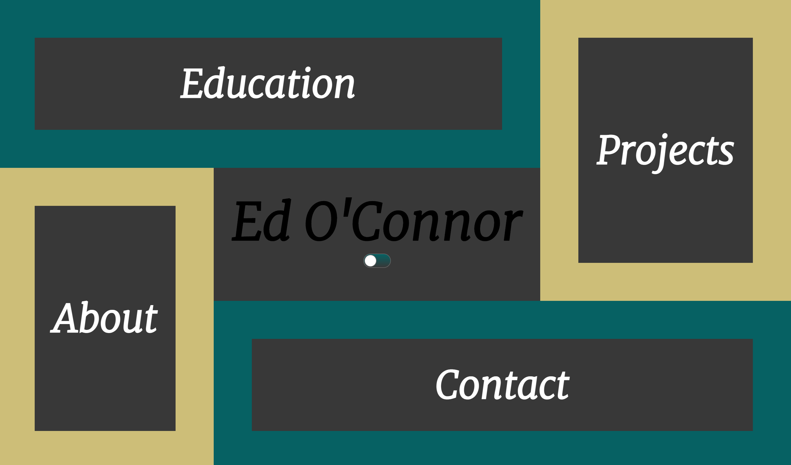
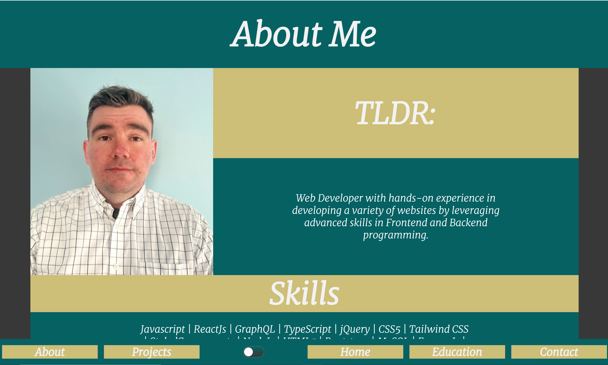
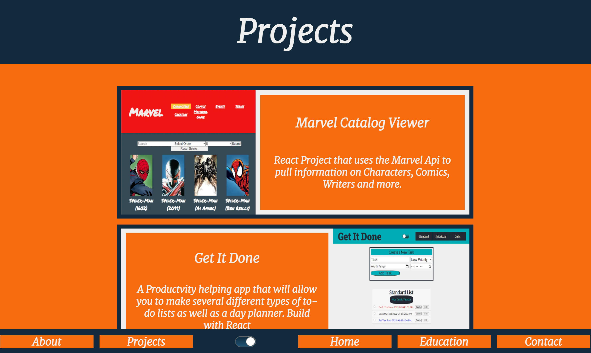
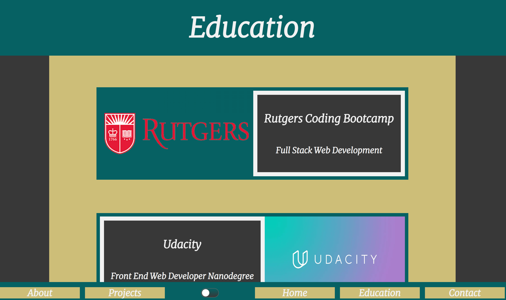
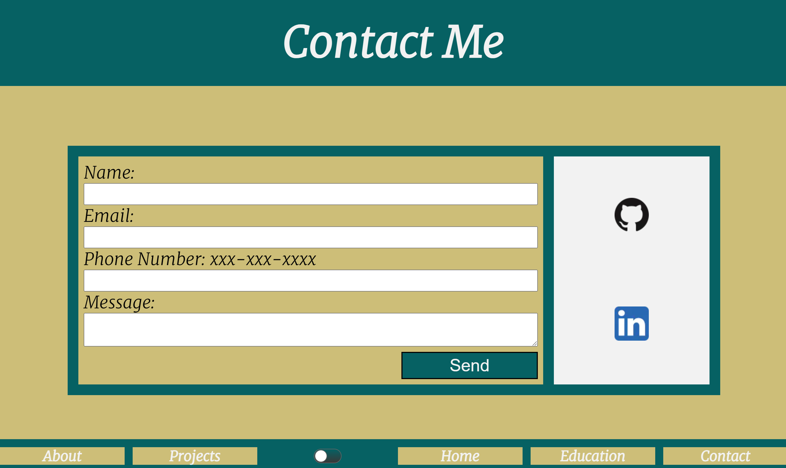

# Ed's Portfolio

Hi! - welcome to _My Portfolio_!

Included is a little information about me, my education, some of my projects, and a contact page

## Home

## About Me

## Projects

## Education

## Contact

### Tools used

_My Portfolio_ is built with NextJs.  I used styled components for the styling, Framer Motion for the animation and EmailJs for the contact Page.

### How to get started

**First Clone the repo**

**yarn install**

**yarn dev**

### Site hosted on Vercel here 

[Portfolio](eddev90.vercel.app)

